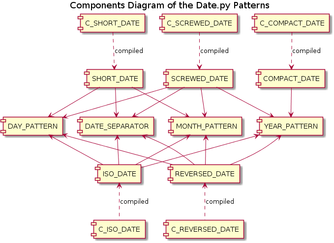
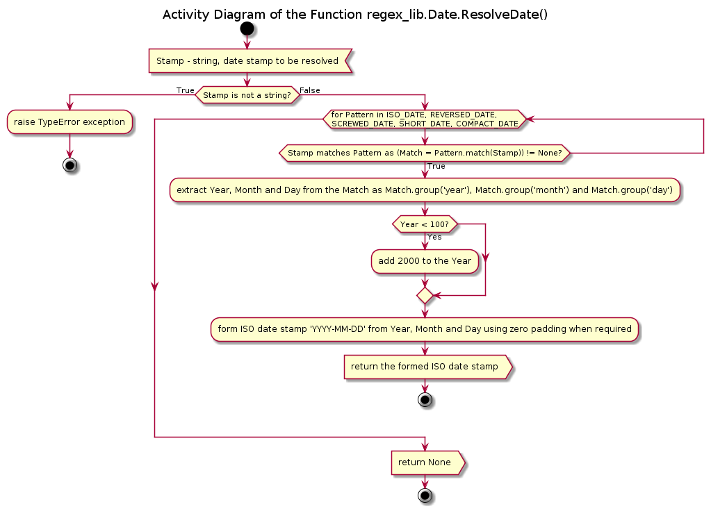

# Module Date<span />.py Reference

## Table of Content

* [Introduction](#Introduction)
* [Software Requirements](#Software-Requirements)
* [Design](#Design)
* [API Reference](#API-Reference)

## Introduction

This module implements a set of regular expression patterns designed for the recognition and extraction of the date stamps in various formats from string / text data as well as a search aggregation function, which iterates through all defined formats and tries to match the input data against them until a match is found or all formats are tried out.

The purpose of this module is to provide an easy yet robust tool for the date information extraction from data files or other textual data created with software disregarding international standards and using locale dependent formats instead, e.g., day – month – year or month – day -year instead of year – month – day format.

The implemented functionality doesn’t cover all possible formats, just the most often encountered (in the author’s personal experience). Note that only numeric month’s representation is supported, not month’s name (or abbreviation thereof); days of a week and week number are not supported either.

## Software Requirements

This module is written in Python 2.7 (version 2.7.11 / 2.7.12) and is tested under MS Windows 7 Professional (64-bit, Service Pack 1) as well as Linux Mint 18.3 “Sylvia” (64-bit, MATE desktop).

There are no external dependencies / third party packages for this module, neither it depends on any other module within the **regex_lib** library.

## Design

The module provides 3 levels of the interface:

* Actual (raw) string regular expression patterns, which can be imported and used as the arguments of the functions of the Standard Python Library module **re**, e.g. *re.earch*(), *re.match*(), *re.compile*(), etc.
* Compiled versions of the most useful patterns, i.e. instances of the class *re.RegexObject*, which can also be imported and used separately
* Aggregated search function **ResolveDate**(), which implements matching of the passed string against all appropriate regular expression patterns defined in order to extract the date stamp and to return it in the ISO format as a string.

### Basic Patterns

```python
YEAR_PATTERN = r"(?P<year>((00)|(19)|(20))[0-9]{2})"
```

Only the years between 1900 and 2099 (inclusively) are allowed from the practical reasons. If the first two digits are zeroes (e.g. 0018), such notation is treated as years between 2000 and 2099.

```python
MONTH_PATTERN = r"(?P<month>(0?[1-9])|(1[0-2]))"
```

The months of the year are allowed between 1 and 12. Months 1 to 9 can be indicated with or without the leading zero, i.e. 01 and 1 are equivalent.

```python
DAY_PATTERN = r"(?P<day>(0?[1-9])|([1-2][0-9])|(3[0-1]))"
```

The days of the month are allowed between 1 and 31 (no extra days per months checks are implemented). Days 1 to 9 can be indicated with or without the leading zero, i.e. 01 and 1 are equivalent.

```python
DATE_SEPARATOR = r"((-)|(/)|(_)|(\.))"
```

Any of the characters: ‘-’, ‘/’, ‘_’ or ‘.’ - are allowed to be used as separators between year, month and day parts and in any combinations. In the examples below only ‘/’ is used for clarity.

### Date Stamp Patterns

```python
ISO_DATE = r"(.*[^0-9]|^)" + YEAR_PATTERN + DATE_SEPARATOR + MONTH_PATTERN + DATE_SEPARATOR + DAY_PATTERN + r"([^0-9].*|$)"
```

Year – month – day order as YYYY/{M}M/{D}D. {} brackets indicate optional digits.

```python
REVERSED_DATE = r"(.*[^0-9]|^)" + DAY_PATTERN + DATE_SEPARATOR + MONTH_PATTERN + DATE_SEPARATOR + YEAR_PATTERN + r"([^0-9].*|$)"
```

Day – month – year order as {D}D/{M}M/YYYY . {} brackets indicate optional digits.

```python
SCREWED_DATE = r"(.*[^0-9]|^)" + MONTH_PATTERN + DATE_SEPARATOR + r"(?P<day>(1[3-9])|(2[0-9])|(3[0-1]))" + DATE_SEPARATOR + YEAR_PATTERN + r"([^0-9].*|$)"
```

Month – day – year order as {M}M/DD/YYYY . {} brackets indicate optional digits. Since it can be differentiated from the previous pattern only for day >= 13, the allowed day value range is limited to 13 to 31 inclusively.

```python
COMPACT_DATE = r"(.*[^0-9]|^)" + YEAR_PATTERN + r"(?P<month>(0[1-9])|(1[0-2]))(?P<day>(0[1-9])|([1-2][0-9])|(3[0-1]))([^0-9].*|$)"
```

Year – month – day order without separators exactly as YYYYMMDD, thus days or months <= 9 must use extra zero padding.

```python
SHORT_DATE = r"(.*[^0-9]|^)(?P<year>[0-9]{2})" + DATE_SEPARATOR + MONTH_PATTERN + DATE_SEPARATOR + DAY_PATTERN + r"([^0-9].*|$)"
```

Year – month – day order as YY/{M}M/{D}D. {} brackets indicate optional digits. Since only 2 digits are allowed for the year, it is supposed to be between 2000 and 2099 inclusively.

### Relation between Patterns

<a id="ill1">Illustration 1</a>



### Aggregated Search / Patterns Matching Function

The aggregated search / date stamp extraction and conversion function **ResolveDate**() uses the following rules:

* The **TypeError** exception is raised if the input data is not a string
* The regular expression patterns are tried in the order: ISO_DATE, REVERSED_DATE, SCREWED_DATE, SHORT_DATE, COMPACT_DATE – with the first found match returned
* The 2-digits year representation is converted into 2000 – 2099 range
* The 4-digits year representation with first two zeros (e.g. 0018) is converted into 2000 – 2099 range (i.e. 2018 in this example)
* The returned date stamp (if resolved) is always returned in the ISO format as ‘YYYY-MM-DD’ string, using zero padding for days and months if required
* If the input data doesn’t match any of the patterns, the returned value is None

<a id="ill2">Illustration 2</a>



## API Reference

### Functions

**ResolveDate**(strStamp)

Signature:

str -> str OR None

Args:

* *strStamp*: str, string date stamp, possibly not in ISO format

Returns:

* str: the resolved date stamp as a string in ISO format 'YYYY-MM-DD'
* None: value of none of the patterns is matched.

Raises:

* **TypeError**: if the passed argument is not a string.

Description:

Attempts to resolve the passed date stamp with help of the defined regular expression patterns in the following order: ISO_DATE, REVERSED_DATE, SCREWED_DATE, SHORT_DATE, COMPACT_DATE