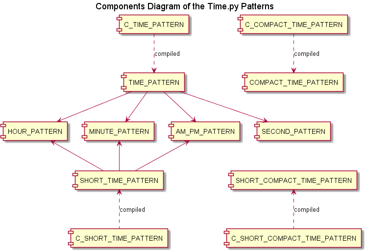
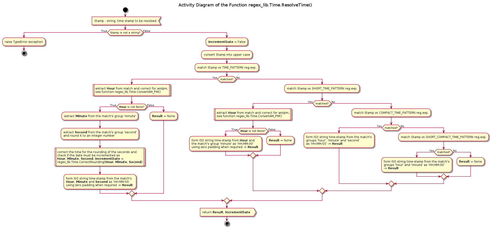
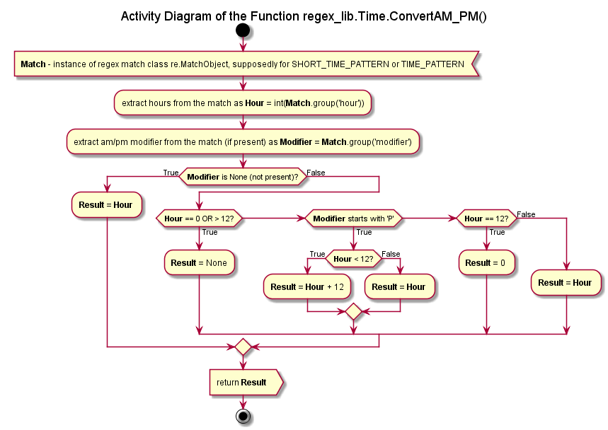
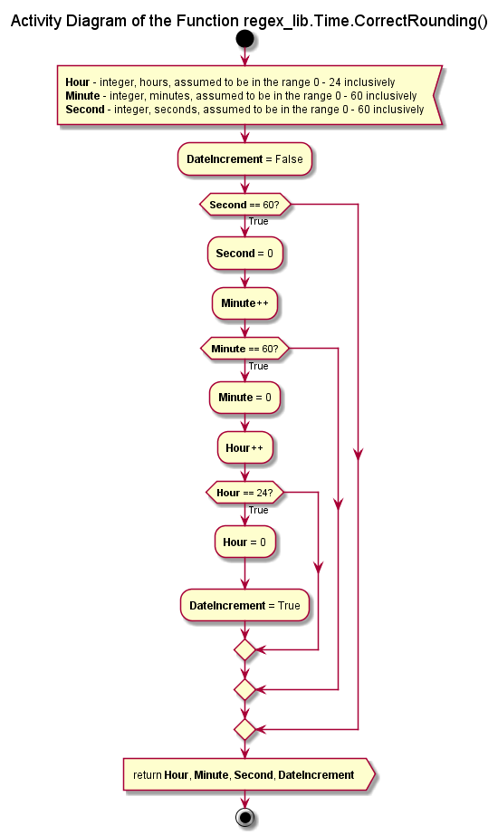

# Module Time<span />.py Reference

## Table of Content

* [Introduction](#Introduction)
* [Software Requirements](#Software-Requirements)
* [Design](#Design)
* [API Reference](#API-Reference)

## Introduction

This module implements a set of regular expression patterns designed for the recognition and extraction of the time stamps in various formats from string / text data as well as a search aggregation function, which iterates through all defined formats and tries to match the input data against them until a match is found or all formats are tried out.

The purpose of this module is to provide an easy yet robust tool for the time information extraction from data files or other textual data created with software disregarding international standards and using locale dependent formats instead, e.g., 12-hour clock instead of 24-hour clock.

The implemented functionality doesn’t cover all possible formats, just the most often encountered (in the author’s personal experience). Note that A.M. / P.M. (12-hour clock) support is implemented following NIST recommendations for the noon and midnight transition, but the ‘noon’ (or ‘midday’) and ‘midnight’ designations for a specific time are not supported.

Milliseconds noted as decimal fractions of seconds are supported but automatically rounded to the integer number of seconds as < 0.5 – down and >= 0.5 – up. This rounding is treated correctly, i.e. in the case of 59.x sec → 60 sec the seconds are wind down to 0 and the minutes are incremented by 1. The same approach is taken with minutes and hours. In the worst case scenario 23:59:59.x → 00:00:00 and a special flag is set indicating the necessity to increment the date.

## Software Requirements

This module is written in Python 2.7 (version 2.7.11 / 2.7.12) and is tested under MS Windows 7 Professional (64-bit, Service Pack 1) as well as Linux Mint 18.3 “Sylvia” (64-bit, MATE desktop).

There are no external dependencies / third party packages for this module, neither it depends on any other module within the **regex_lib** library

## Design

The module provides 3 levels of the interface:

* Actual (raw) string regular expression patterns, which can be imported and used as the arguments of the functions of the Standard Python Library module **re**, e.g. *re.earch*(), *re.match*(), *re.compile*(), etc.
* Compiled versions of the most useful patterns, i.e. instances of the class *re.RegexObject*, which can also be imported and used separately
* Aggregated search function **ResolveTime**(), which implements matching of the passed string against all appropriate regular expression patterns defined in order to extract the time stamp and to return it in the ISO format as a string.

### Base Patterns

```python
HOUR_PATTERN = r"(?P<hour>(([0-1]?[0-9])|(2[0-3])))"
```

Defines hours as one or two digits (0 to 23 inclusively), with he leading zero may be used or skipped for the hours <= 9.

```python
MINUTE_PATTERN = r"(?P<minute>[0-5]?[0-9])"
```

Defines minutes as one or two digits (0 to 59 inclusively), with he leading zero may be used or skipped for the minutes <= 9.

```python
SECOND_PATTERN = r"(?P<second>[0-5]?[0-9]((\.|,)[0-9]+)?)"
```

Defines seconds as the integer part (0 to 59 inclusively) with an optional decimal fraction part (milliseconds) using one or more digits and comma (‘,’) or dot (‘.’) as separator. For seconds <= 9 the leading zero may be used or skipped.

```python
AM_PM_PATTERN = r" ?(?P<modifier>(A|P)\.?M\.?)?”
```
Defines AM / PM modifier prefix with an optional white-space before and the optional dots between the leters.

### Time Stamp Patterns

```python
SHORT_TIME_PATTERN = r"(.*[^0-9:]|^)" + HOUR_PATTERN + “:” + MINUTE_PATTERN + AM_PM_PATTERN + r"([^0-9:].*|$)"
```

{H}H:{M}M{ AM/PM} format. {} brackets signify the optional parts. 12-hours and 24-hours clock support, although AM/PM modifier in combination with hours > 12 or == 0 is an obvious mistake. The aggregated search function treats such case as not a match.

```python
TIME_PATTERN = r"(.*[^0-9:]|^)" + HOUR_PATTERN + “:” + MINUTE_PATTERN + ":" +  SECOND_PATTERN + AM_PM_PATTERN + r"([^0-9:].*|$)"
```

{H}H:{M}M:{S}S{.ms}{ AM/PM} format. {} brackets signify the optional parts.  12-hours and 24-hours clock support, although AM/PM modifier in combination with hours > 12 or == 0 is an obvious mistake. The aggregated search function treats such case as not a match. Milliseconds are rounded to the integer seconds by the aggregated search function.

```python
SHORT_COMPACT_TIME_PATTERN = r"(.*[^0-9]|^)(?P<hour>([0-1][0-9])|(2[0-3]))(?P<minute>[0-5][0-9])" + r"([^0-9].*|$)
```

HHMM format (without separators). Hours and minutes must be defined always as 2 digits, thus using left zero padding for numbers <= 9. 24-hour clock notation only.

```python
COMPACT_TIME_PATTERN = r"(.*[^0-9]|^)(?P<hour>([0-1][0-9])|(2[0-3]))(?P<minute>[0-5][0-9])" +
r"(?P<second>[0-5][0-9])([^0-9].*|$)
```

HHMMSS format (without separators). Hours, minutes and seconds must be defined always as 2 digits, thus using left zero padding for numbers <= 9. 24-hour clock notation only, milliseconds are not supported.

### Relation between Patterns

<a id="ill1">Illustration 1</a>



### Aggregated Search / Patterns Matching Functions

#### Function ResolveTime

The aggregated search / date stamp extraction and conversion function **ResolveTime**() uses the following rules:

* The **TypeError** exception is raised if the input data is not a string
* The regular expression patterns are tried in the order: TIME_PATTERN, SHORT_TIME_PATTERN, COMPACT_TIME_PATTERN, SHORT_ COMPACT_TIME_PATTERN – with the first found match returned
* The returned time stamp (if resolved) is always in ISO format ‘HH:MM:SS’ using 24-hours clock and left zero padding when required
  - Without the explicit seconds indication (SHORT_TIME_PATTERN and SHORT_ COMPACT_TIME_PATTERN) ‘00’ is used instead of the actual seconds
  - Milliseconds as in SS<span />.ms format (TIME_PATTERN only) are rounded: < 0.5 – rounded down, >= 0.5 – rounded up; with the measures taken to keep the seconds and minutes within 0 – 59 range and the hours – within 0 – 23 range, see function CorrectRounding(), date increment flag is raised when required
  - AM/PM is applicable only if the hour is within 1 – 12 range, otherwise the situation is treated as not a match, see function **ConvertAM_PM**()
  - 12-hour to 24-hour clock conversion is performed using NIST recommendations, see function **ConvertAM_PM**()
* Returned value for the time stamp is None if the input data doesn’t match any of the patterns

<a id="ill2">Illustration 2</a>



#### Function ConvertAM_PM

This helper function implements the rules:

* Time stamp without explicit AM/PM modifier is treated as already in the 24-hour clock representation
* Hour notation in the 12-hour clock (with AM/PM modifier) can be only within 1 to 12 range inclusively, otherwise – there is no match
* Midday / midnight convention used follows the NIST recommendations:
  - midnight = 11:59 p.m. -> 12:01 a.m.
  - 12:00 a.m. to 12:59 a.m. == 00:00 to 00:59 in 24-h
  - 1:00 a.m. to 11:59 a.m == 01:00 to 11:59 in 24-h
  - midday / noun = 11:59 a.m. -> 12:01 p.m.
  - 12:00 p.m. to 12:59 p.m. == 12:00 to 12:59 in 24-h
  - 1:00 p.m. to 11:59 p.m == 13:00 to 23:59 in 24-h

<a id="ill3">Illustration 3</a>



#### Function CorrectRounding

The purpose of this helper function is to correct the time stamp after rounding of the milliseconds using the following rules:

* According to the regular expression patterns rules the hours are limited to 0 – 23, minutes and seconds – to 0 – 59 interval, but due to rounding up of the milliseconds the seconds may become 60
* If after the rounding the seconds become 60, they must be wind down to 0, whilst the minutes counter must be incremented by 1
* If after that the minutes counter becomes 60, it must by rewind to 0, whilst the hours counter must be incremented by 1
* If after that the hours counter is at 24, it must be set to 0 and date increment flag must be set
* The date increment can occur only because of rounding up towards midnight, i.e. 23:59:59.x → 00:00:00

<a id="ill4">Illustration 4</a>



## API Reference

### Functions

**ConvertAM_PM**(objMatch)

Signature:

re.MatchObject -> int OR None

Args:

* *objMatch*: re.MatchObject, instance of, regular expression match object

Returns:

* int: hour in 24-h clock, if the representation was correct
* None: otherwise

Description:

Helper function for the conversion of the a.m. / p.m. time representation (12-hours clock) into 24-hours representation according to the NIST rules:

* midnight = 11:59 p.m. -> 12:01 a.m.
* 12:00 a.m. to 12:59 a.m. == 00:00 to 00:59 in 24-h
* 1:00 a.m. to 11:59 a.m == 01:00 to 11:59 in 24-h
* midday / noun = 11:59 a.m. -> 12:01 p.m.
* 12:00 p.m. to 12:59 p.m. == 12:00 to 12:59 in 24-h
* 1:00 p.m. to 11:59 p.m == 13:00 to 23:59 in 24-h

Note that this function concerns only hours, which are to be extracted from a match object, supposedly for SHORT_TIME_PATTERN or TIME_PATTERN, in any case with the defined groups '*hour*' and '*modifier*'.

**CorrectRounding**(iHour, iMinute, iSecond)

Description:

Helper function for the proper rounding of the seconds. I.e. seconds > 59.5 should be converted into 0, and the minutes should be incremented by 1. If the minutes become 60 - they must be replaced by 0, and the hours - incremented by one. If hours becomes 24 - they must be replaced by 0, and the date should be incremented by 1 day, which is indicated by the returned boolean flag (the last element of the unpacked tuple)

Signature:

int, int, int -> int, int, int, bool

Args:

* *iHour*: int, hours, assumed to be in the range 0 - 24 inclusively
* *iMinutes*: int, minutes, assumed to be in the range 0 - 60 incl.
* *iSeconds*: int, seconds, assumed to be in the range 0 - 60 incl.

Returns:

* tuple(int, int, int, bool): an unpacked tuple of 3 integers (as the corrected for the swinging over zero hours, minutes and seconds) and a boolean flag if the date should be incremented by 1 day.

**ResolveTime**(strStamp)

Signature:

str -> str OR None, bool

Args:

* *strStamp*: str, string time stamp, possibly not in ISO format

Returns:

* tuple(str, bool): unpacked tuple, the resolved time stamp as a string in ISO format 'HH:MM:SS' and the boolean flag if the date must be incremented due to rounding up of the seconds, i.e. 23:59:59.5 -> 00:00:00 of the next day.
* tuple(None, bool): unpacked tuple, if none of the patterns is matched

Raises:

* **TypeError**: the passed argument is not a string

Description:

Attempts to resolve the passed time stamp with help of the defined regular expression patterns in the following order: TIME_PATTERN, SHORT_TIME_PATTERN, COMPACT_TIME_PATTERN, SHORT_COMPACT_TIME_PATTERN

Note that the floating point representation of the seconds is rounded to an integer, which may cause swinging over zero of the seconds (60 -> 00) and incrementing of the minutes; and so on including the hours.

See also helper functions:

* ConvertAM_PM()
* CorrectRounding()