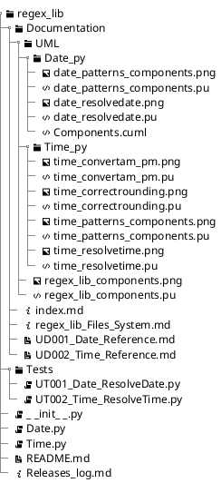

# File Structure of the Package regex_lib

```plantuml
@startuml

salt
{
    {T
    <&folder> regex_lib
    + <&folder> Documentation
    ++ <&folder> UML
    +++ <&folder> Date_py
    ++++ <&image> date_patterns_components.png
    ++++ <&code> date_patterns_components.pu
    ++++ <&image> date_resolvedate.png
    ++++ <&code> date_resolvedate.pu
    ++++ <&code> Components.cuml
    +++ <&folder> Time_py
    ++++ <&image> time_convertam_pm.png
    ++++ <&code> time_convertam_pm.pu
    ++++ <&image> time_correctrounding.png
    ++++ <&code> time_correctrounding.pu
    ++++ <&image> time_patterns_components.png
    ++++ <&code> time_patterns_components.pu
    ++++ <&image> time_resolvetime.png
    ++++ <&code> time_resolvetime.pu
    +++ <&image> regex_lib_components.png
    +++ <&code> regex_lib_components.pu
    ++ <&info> index.md
    ++ <&info> regex_lib_Files_System.md
    ++ <&document> UD001_Date_Reference.md
    ++ <&document> UD002_Time_Reference.md
    + <&folder> Tests
    ++ <&script> UT001_Date_ResolveDate.py
    ++ <&script> UT002_Time_ResolveTime.py
    + <&script> _ _init_ _.py
    + <&script> Date.py
    + <&script> Time.py
    + <&document> README.md
    + <&info> Releases_log.md
    }
}

@enduml
```